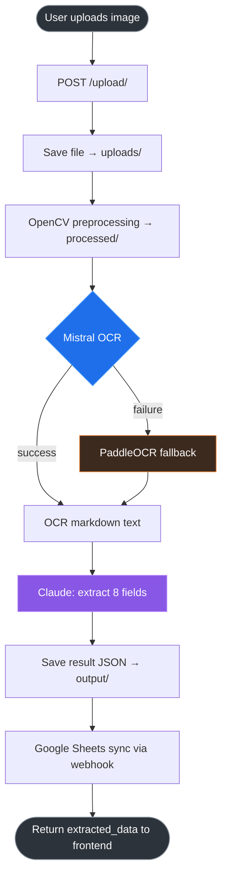
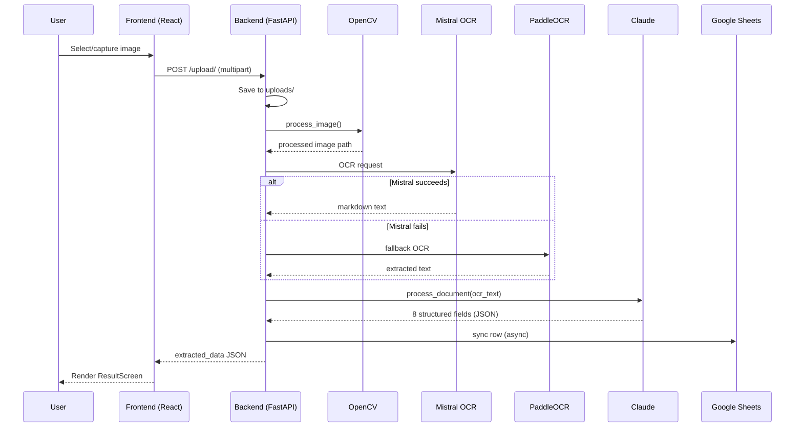
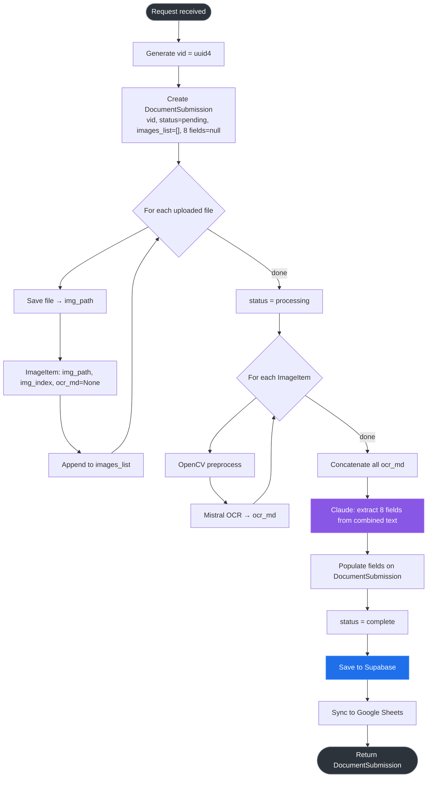

<div align="center">

# MCL Patr

### Municipal Corporation Ludhiana — Document Digitization System

Captures physical government correspondence, extracts text via OCR, and structures it into searchable fields using an LLM.
Multilingual support: **English · Hindi · Punjabi (Gurmukhi)**

[](https://mcl-ocr.vercel.app)
[](https://mcl-ocr.onrender.com)
[]()

</div>

---

## Live Deployments

| Service  | URL                                                              |
| -------- | ---------------------------------------------------------------- |
| Frontend | [mcl-ocr.vercel.app](https://mcl-ocr.vercel.app)               |
| Backend  | [mcl-ocr.onrender.com](https://mcl-ocr.onrender.com)           |

> **Note:** Backend runs on Render free tier — expect a ~50s cold start after inactivity.

---

## Stack

| Layer            | Technology                  | Purpose                                        |
| ---------------- | --------------------------- | ---------------------------------------------- |
| Frontend         | React 19 + Vite + TypeScript | Document scanner UI                            |
| Backend          | FastAPI + Uvicorn           | REST API, pipeline orchestration               |
| Image Processing | OpenCV                      | Preprocessing — blur, sharpen, denoise         |
| Primary OCR      | Mistral OCR (`mistral-ocr-latest`) | Text extraction, multilingual         |
| Fallback OCR     | PaddleOCR (PaddleX)         | Local fallback if Mistral fails                |
| LLM Extraction   | Anthropic Claude (`claude-sonnet-4-6`) | Structured field extraction from OCR text |
| Sheets Sync      | Google Apps Script webhook  | Appends extracted data to monthly Google Sheet |
| Database         | Supabase (PostgreSQL)       | Planned — 30-day TTL storage                   |
| Deployment       | Render (backend), Vercel (frontend) | Cloud hosting                          |

---

## Pipeline



**Request lifecycle, sequence view:**



---

## Extracted Fields

All fields extracted in English. Null when not found in document.

```json
{
  "date": "",
  "subject": "",
  "summary": "",
  "department": "",
  "sender_name": "",
  "sender_contact": null,
  "receiver": "",
  "reference_number": null
}
```

`department` is matched against a hardcoded list of 22 MCL departments.

---

## Repository Structure

```
MCL-OCR/
├── backend/
│   ├── app/
│   │   ├── main.py                     # FastAPI init, CORS, router registration
│   │   ├── config.py                   # API client init (Anthropic, Mistral, Supabase)
│   │   ├── routes/
│   │   │   ├── upload.py               # POST /upload/ — full pipeline
│   │   │   └── health.py               # GET /health
│   │   ├── services/
│   │   │   ├── mistral_ocr_services.py # Primary OCR — Mistral API
│   │   │   ├── paddle_ocr_service.py   # Fallback OCR — PaddleX
│   │   │   ├── claude_service.py       # LLM structured extraction
│   │   │   ├── opencv_services.py      # Image preprocessing
│   │   │   └── sheets_service.py       # Google Sheets sync
│   │   ├── utils/
│   │   │   └── file_utils.py           # File save, result JSON persistence
│   │   └── schemas/                    # Pydantic models (planned)
│   ├── tests/
│   │   └── test_mistral_service.py
│   ├── requirements.txt
│   ├── Dockerfile
│   └── docker-compose.yml
├── frontend/
│   └── src/
│       ├── App.tsx                     # Screen state, API call, flow wiring
│       ├── CameraScreen.tsx            # Camera capture + file upload
│       ├── ReviewScreen.tsx            # Image review before processing
│       ├── ProcessingScreen.tsx        # Pipeline animation with stage states
│       └── ResultScreen.tsx            # 8-field extraction display
└── docs/
    └── CODEBASE_REPORT.md
```

---

## Local Development

### Prerequisites

- Python 3.10+
- Node.js 18+
- Docker (optional)

### Backend

```bash
cd backend
pip install -r requirements.txt

# Set environment variables
export ANTHROPIC_API_KEY=your_key
export MISTRAL_API_KEY=your_key
export GOOGLE_SHEETS_WEBHOOK_URL=your_url

uvicorn app.main:app --reload --port 8000
```

### Frontend

```bash
cd frontend
npm install
npm run dev
```

Frontend runs on `http://localhost:5173` and expects backend at `http://localhost:8000`.

### Docker

```bash
cd backend
docker-compose up --build
```

---

## Environment Variables

| Variable                   | Required | Purpose                          |
| -------------------------- | -------- | -------------------------------- |
| `ANTHROPIC_API_KEY`        | Yes      | Claude LLM extraction            |
| `MISTRAL_API_KEY`          | Yes      | Primary OCR                      |
| `GOOGLE_SHEETS_WEBHOOK_URL`| Yes      | Sheets sync via Apps Script      |
| `SUPABASE_URL`             | No       | Planned DB integration           |
| `SUPABASE_KEY`             | No       | Planned DB integration           |

---

## Google Sheets Structure

- Organized by month — August sheet, September sheet, etc.
- Apps Script creates the month sheet if it doesn't exist.
- Columns: all 8 extracted fields + original filename + `processed_at` (IST timestamp).

---

## Hard Constraints

These will not change for this project:

- No authentication or RBAC
- No agents or streaming
- No permanent image storage in database
- No centralized MCL platform

---

## Branches

| Branch   | Owner      | Scope                                      |
| -------- | ---------- | ------------------------------------------ |
| `main`   | Both       | Merged, deployed                           |
| `uv-dev` | Yuvraj     | Backend, LLM, pipeline wiring, routing, UI |
| `AD-dev` | Arshdeep   | Frontend camera, OpenCV preprocessing      |

---

## What's Working

- Mistral OCR handles English, Hindi, and Punjabi/Gurmukhi correctly
- Claude extracts all 8 fields accurately from OCR text
- PaddleOCR fallback activates if Mistral fails
- Google Sheets updated per document with IST timestamp
- Full frontend flow: camera/upload → review → processing animation → result
- Deployed and tested on mobile

---

## Pending / Next Steps

1. **Multi-image support** — 1–3 images per submission, combined OCR fed to Claude
2. **Supabase integration** — persistent storage with 30-day TTL
3. **Document submission object** — `vid` (uuid4), `status`, `images_list` with per-image OCR
4. **Human review flow** — edit extracted fields before saving
5. **Pydantic schemas** — request/response validation in `schemas/`
6. **Document view page** — browse and filter past documents
7. **Render upgrade** — move to Starter ($7/month) before commissioner demo to eliminate cold start
8. **Office network restriction** — firewall to MCL IP range only

### Planned: Multi-Image Flow



See [`DESIGN.md`](./DESIGN.md) for the reasoning behind this structure.